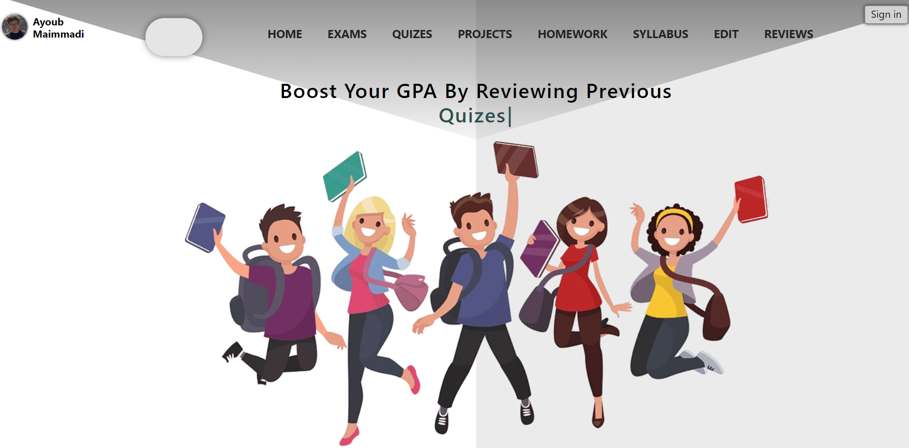

# GPA-Booster

## Agile Software Engineering Project using React: (MongoDB/Express/Bootstrap)

## Allows AUIers to easily find old exams, quizes, projects, and homeworks.

### You can also Add and Delete new ITems, and leave reviews for you friends to read!

To use you need to:

1- Clone or Download this repository

2- Have node.js pre-installed in you computer

3- Launch your IDE and cd into the projct

4- open terminal and run:

##### - `npm or yarn install` to install node modules in the client and server folders

##### - `npm or yarn start` to open developement at localhost:3000 in the client side

##### - `npm or yarn start` to open developement at localhost:5000 in the server side

#### View website -> https://gpa-booster.vercel.app/

#### View website's API -> https://gpa-booster-api.herokuapp.com/exams
